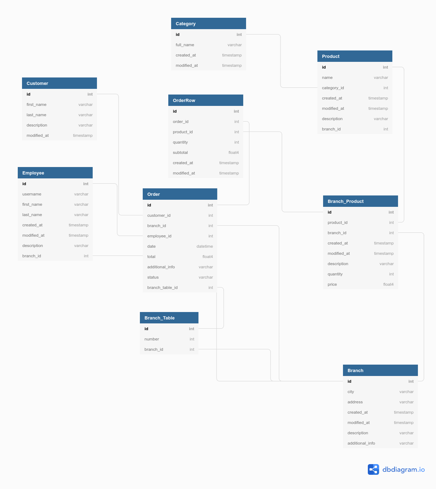

# Alo'konobar

Alo' konobar is a sophisticated and robust platform to modernize ordering and POS systems in restaurants and caffees'.

One of the main features of a platform is a possibility to view the menu from scanning a QR code and commiting an order without need for a waiter. There would also be a possiblity to pay on-line by GPay or other third party service. Platform would provide a better customer experience and would automate certain unnecessary tasks for staff.

From a technical standpoint, platform is divided into 2 separated client applications that communicate with same server with database that is hosted in a cloud.
On a customer size, scanning a QR code is a trigger that enables user to enter web application for viewing restaurant offer and to place an order. On a staff side, there is a desktop app with basic POS functionalities where customer order would arrive in real-time fashion. For storing data, PostgreSQL database would be used. Stack used to develop this platform would be SpringBoot for server side, React/Flutter for a customer client side, Flutter for staff desktop app and PostgreSQL for storing persistant data.

## Use-case architecture

## Database ER diagram

### UNDER DEVELOPMENT
